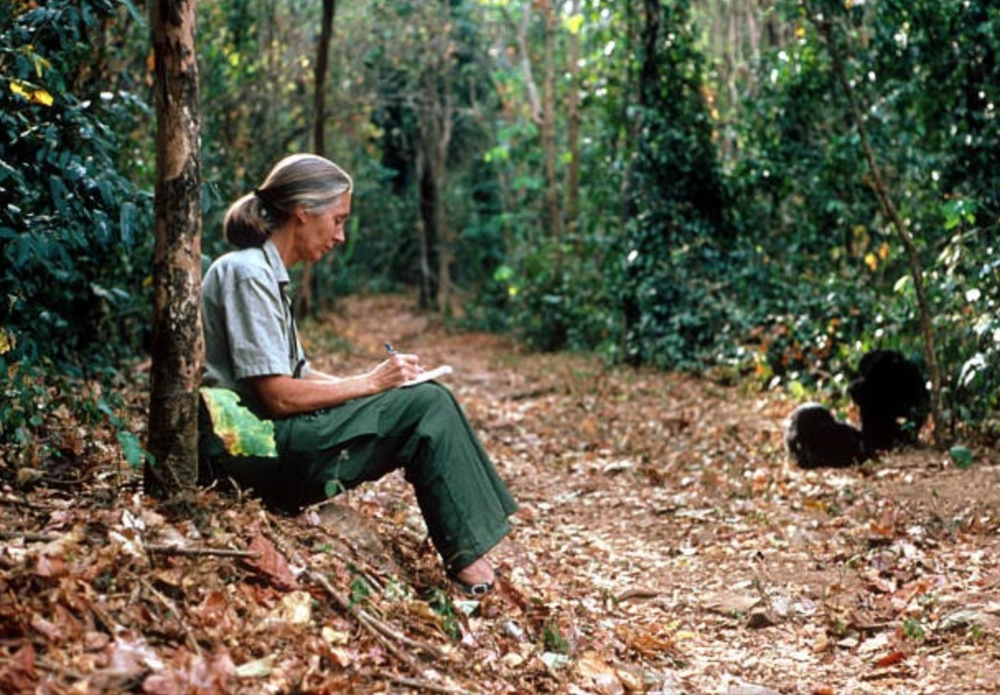
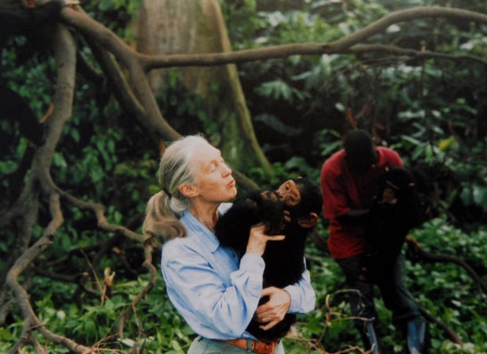
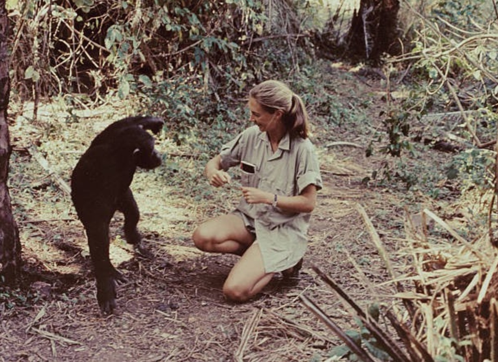
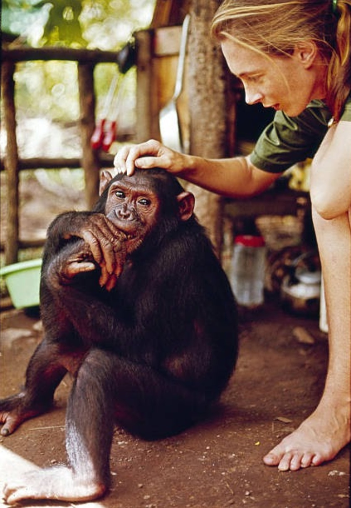
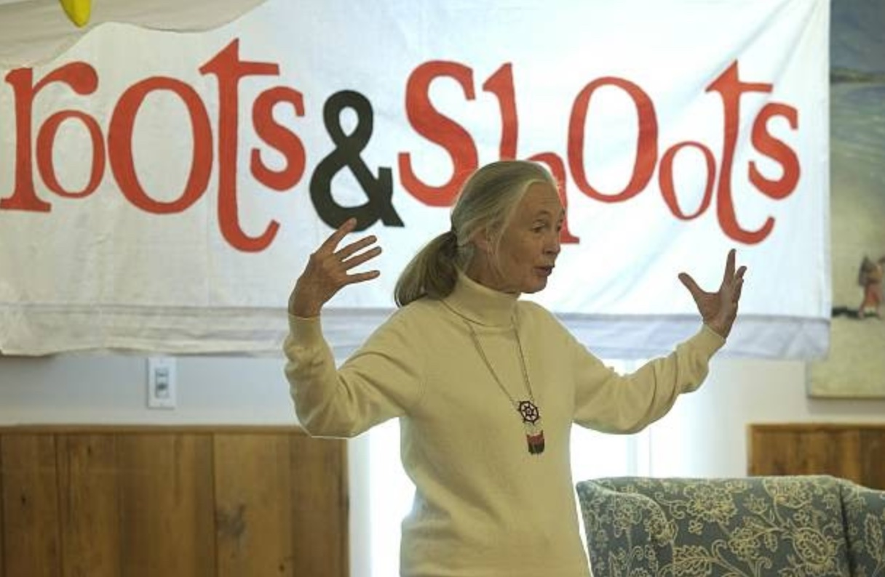
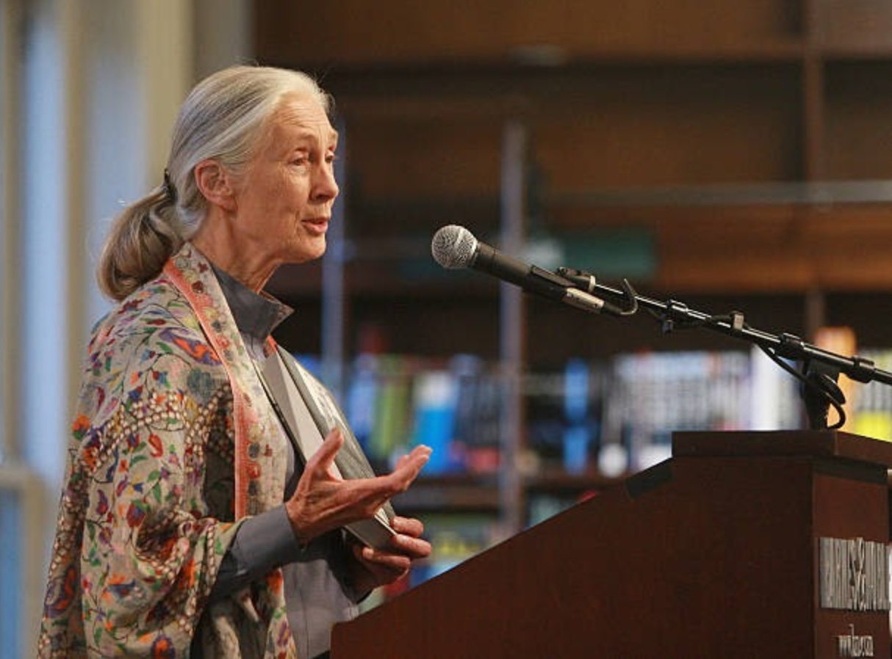
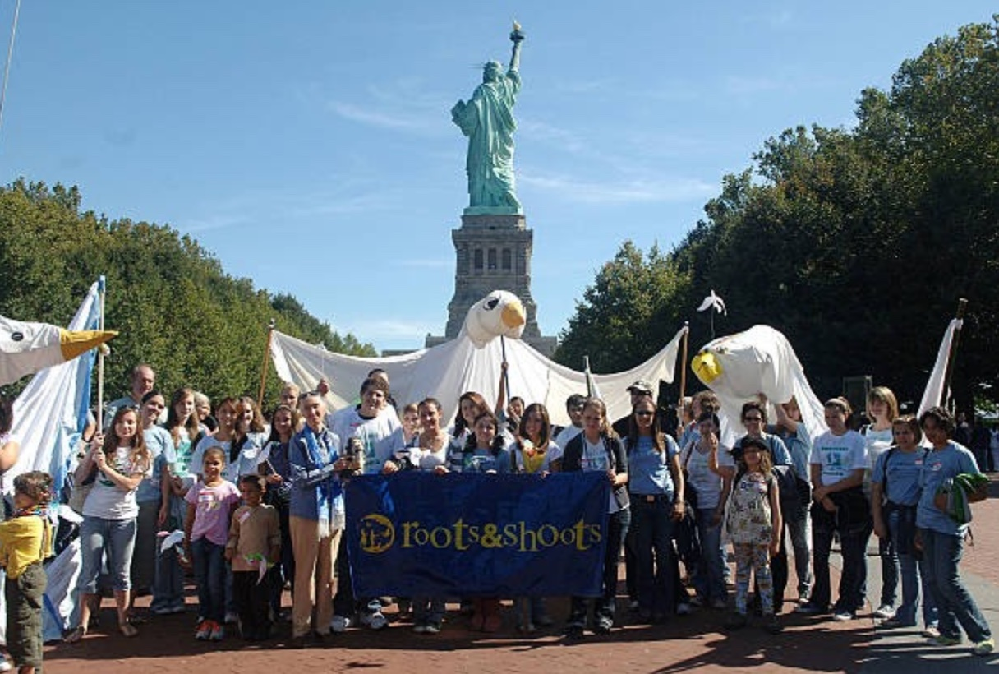
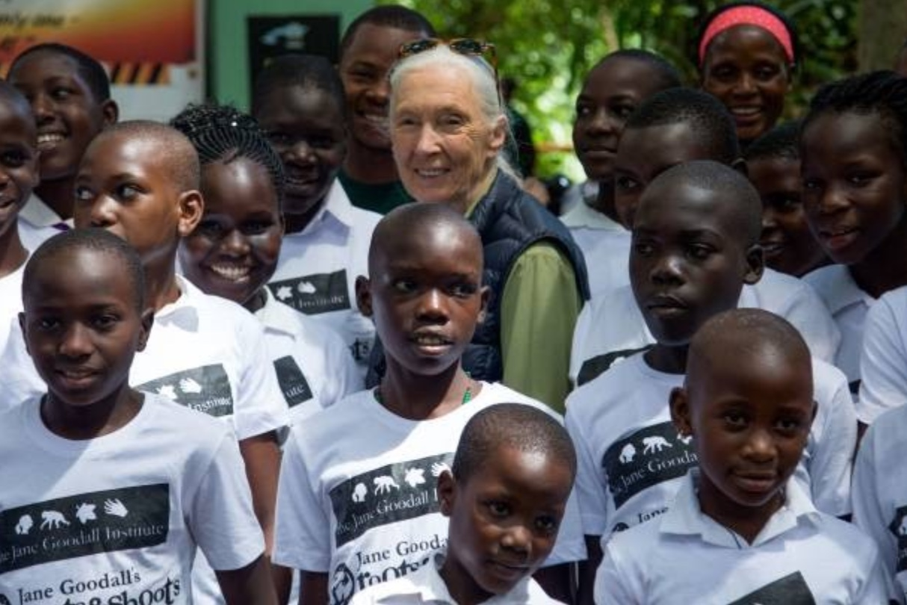
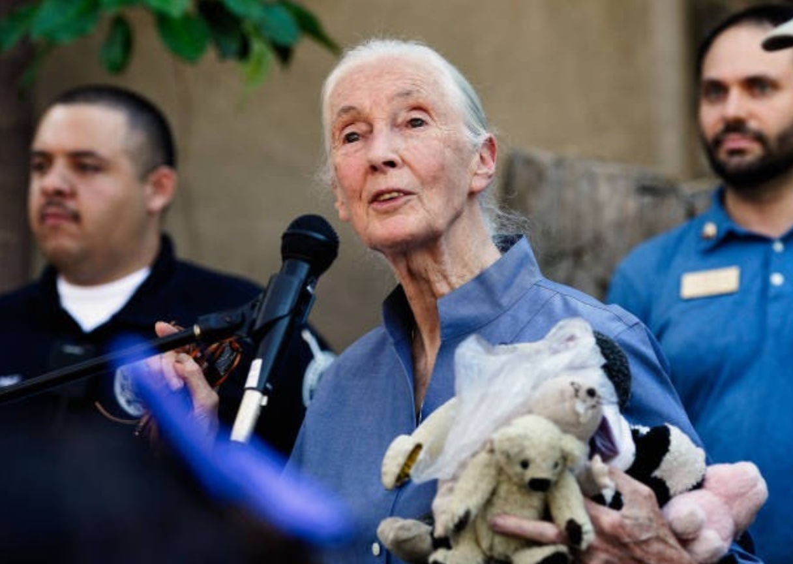
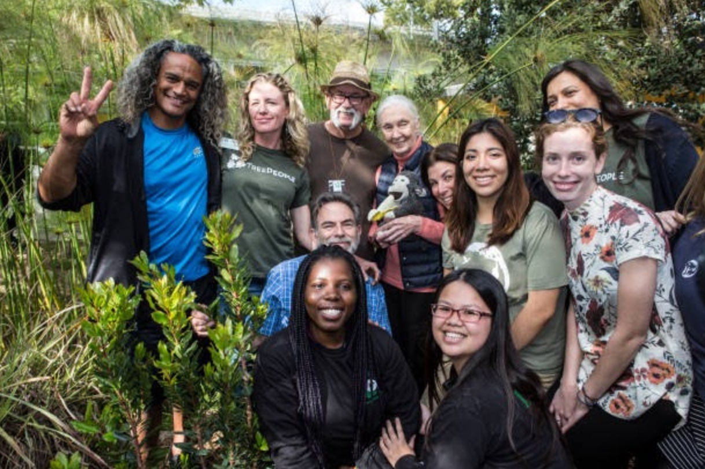

# Thesis
 In July of 1960, Jane Goodall started her study on chimpanzees in Gombe National Park, Tanzania.  After 60 years of research on chimpanzee behavior, Jane now travels the world, communicating to everyone she meets about how now is the time to help save the earth, and by doing that, help the chimpanzees. 

 # Biography
Jane has dedicated her life to helping chimpanzees and the Earth. 

Jane Goodall, a British ethologist, was born on April 30, 1934 in London, England. Twenty-six years later she started her 56 year long study on chimpanzees. Even in her childhood, Goodall loved animals; "I was born loving animals, and the most important thing was, I had a very supportive mother. She didn't get mad when she found earthworms in my bed, she just said they better be in the garden. And she didn't get mad when I disappeared for four hours and she called the police, and I was sitting in a hen house, because nobody would tell me where the hole was where the egg came out." (Aderson) 

One of the reasons Jane Goodall was picked to study chimpanzees is because of her amazing patience to watch wildlife. Which she even displayed in her childhood. Jane once said "I had no dream of being a scientist, because women didn't do that sort of thing. In fact, there weren't many men doing it back then, either. And everybody laughed at me except Mom, who said, "If you really want this, you're going to have to work awfully hard, take advantage of every opportunity, if you don't give up, maybe you'll find a way."(Anderson) Goodall’s mother played a big part in her life. Her mother spent the first year with her because the British Government did not feel it was okay for her to be alone. While Jane explored the Jungles her mother taught and healed the local people which gained support for Jane from the locals. 

# Goodall & the Chimpanzees

Goodall has taught us so much about chimpanzees. Before Jane, everyone thought that chimpanzees were peaceful vegetarians, but she changed that. Jane discovered that chimpanzees use tools; they eat meat; and different troops will fight each other. 

It was not easy to study the chimpanzees; "The animals fled from Jane in fear. With patience and determination she searched the forest every day, deliberately trying not to get too close to the chimpanzees too soon. Gradually the chimpanzees accepted her presence." ("Biography" Jane Goodall Institute Uk) It took almost a year before Jane could get close to the chimpanzees. The first chimpanzee that would come close to Jane was a big male named David Greybeard. Later on in her study she could walk freely among the chimps and even groom them. 

Jane created new ways of studying animals; "Goodall had little professional training in animal studies. She worked unconventionally, doing things like giving the chimpanzees names instead of numbers and perceiving the individual personality of each one. She also found that baiting the animals with bananas helped to attract them close enough for her to observe their social behavior and to photograph them." (Brown) From these ways Jane was able to learn so much more than any other scientist at the time by using these methods. She was able to observe them eat, give birth, fight, hunt, groom, use tools, and a lot of other special moments. After Jane left the chimpanzees and Gombe she made it her mission to teach the world about chimpanzees and about how now is the time to help chimpanzees.

# Educating the World

Jane Goodall has made it her mission to teach the world about how we need to save the earth. Besides traveling all over the world to teach people about wildlife, Goodall founded Roots and Shoots and the Jane Goodall institute to educate people. Through these programs Jane has almost taught people in every country. 

Before she passes on, Jane is determined to teach everyone to care for the earth and all wildlife; "Today, Dr. Jane Goodall travels around the world, writing, speaking and spreading hope through action, encouraging each of us to use the gift of our life to make the world a better place. As a conservationist, humanitarian and crusader for the ethical treatment of animals, she is a global force for compassion and a UN Messenger of Peace." ("About Jane") 

Jane has given her life for the earth. She is constantly traveling around the world  to teach people about wildlife. Because of this, she only sees her family about once a year. (Goldberg) 

One of Jane’s greatest achievements is Roots and Shoots; "In 1977 she co founded the Jane Goodall Institute for Wildlife Research, Education and Conservation (commonly called the Jane Goodall Institute) in California; the centre later moved its headquarters to the Washington, D.C., area. She also created various other initiatives, including Jane Goodall’s Roots & Shoots (1991), a youth service program." (EB Editors) Roots and Shoots is a worldwide program (in nearly 100 countries) connecting children closer to nature. Jane’s goal in creating it was to get children closer to nature and become good leaders. Jane's programs have the potential to influence generations to come.

# Impact

Jane Goodall has changed the world. 

Goodall taught us that chimpanzees use tools, fight, hunt, and live in complex family groups. She broke the barrier of only male scientists and now she is one of the most famous scientists ever. Jane has given us a greater understanding of the earth; "Through nearly 60 years of groundbreaking work, Dr. Jane Goodall has not only shown us the urgent need to protect chimpanzees from extinction; she has also redefined species conservation to include the needs of local people and the environment" ("About Jane") 

Besides just focusing on how we need to protect animals, Jane also helps people. Jane works with people everywhere to appreciate wildlife and live together with it. Goodal changed our beliefs of chimpanzees; "Where many researchers saw "primitive" apes living a simple existence, Goodall found highly intelligent, emotional creatures living in complex social groups. Most dramatically, her work shattered two long-standing myths: the idea that only humans could make and use tools, and the belief that chimps were passive vegetarians." (PBS)  It is evident that Jane  Goodall has changed our knowledge of chimpanzees and understanding of the Earth. 

# About

Here are links to the PDF Process Paper and PDF Annoted Bibliography.

[My Process Paper][3]

[Annoted Bibliography][2]

[2]:bibliography.pdf
[3]:process_paper.pdf

